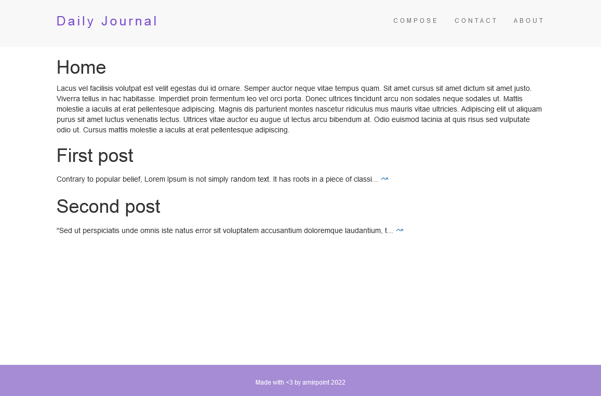
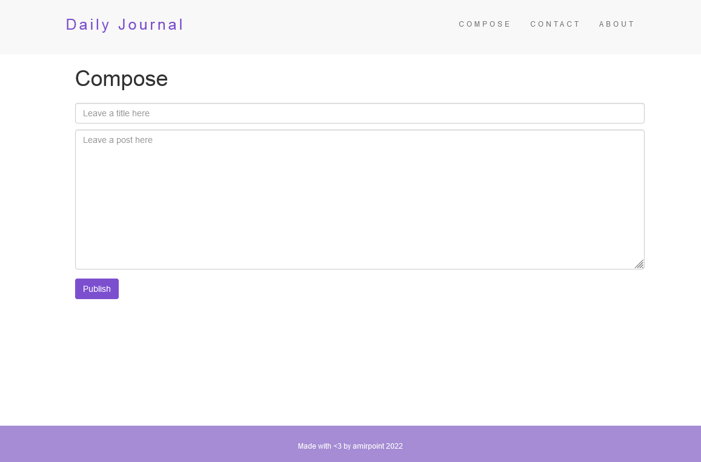
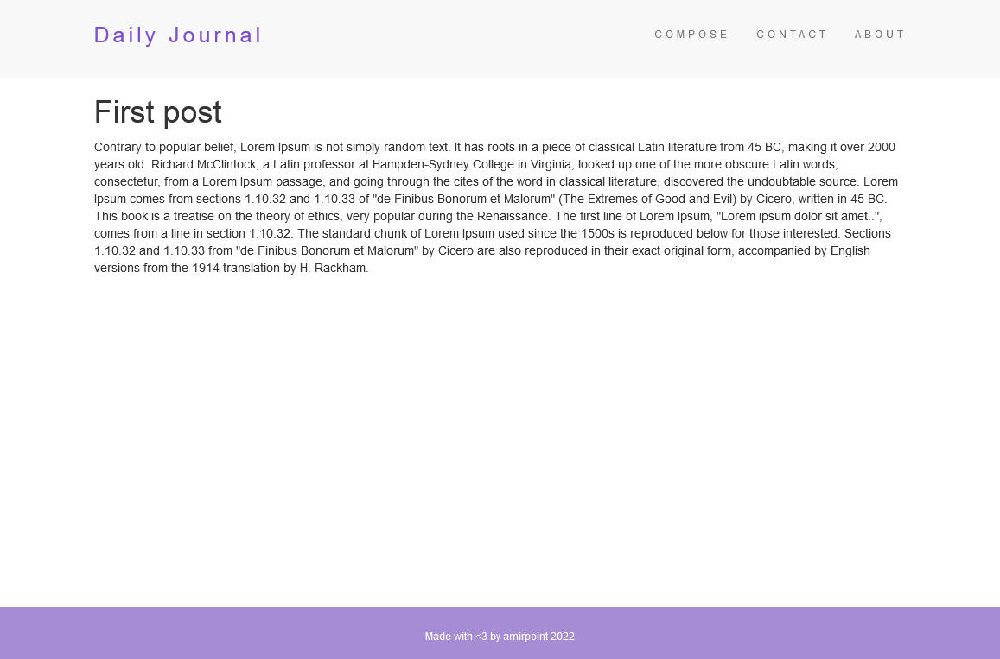

# Blog Website

A fully personal blog (create post with specific direct link)

## Table of contents

- [Overview](#overview)
  - [Installation and Setup Instructions](#installation-and-setup-instructions)
  - [Installation](#installation)
  - [To visit page](#to-visit-page)
- [Screenshots](#screenshots)

## Overview
### Installation and Setup Instructions

Clone down this repository. You will need `node` and `npm` installed on your machine.  

### Installation

```bash
git clone git@github.com:amirpoint/ejs-blog-website.git --depth 1
mv ejs-blog-website my-project
cd my-project
npm i
node app.js
```

### To visit page

main page<br>
`127.0.0.1:8080/`<br><br>
contact page<br>
`127.0.0.1:8080/contact/`<br><br>
compose page<br>
`127.0.0.1:8080/compose/`<br><br>
created post page<br>
`127.0.0.1:8080/posts/:name-of-post`<br>


## Screenshots






